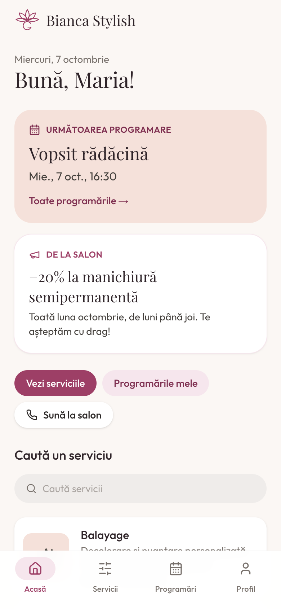
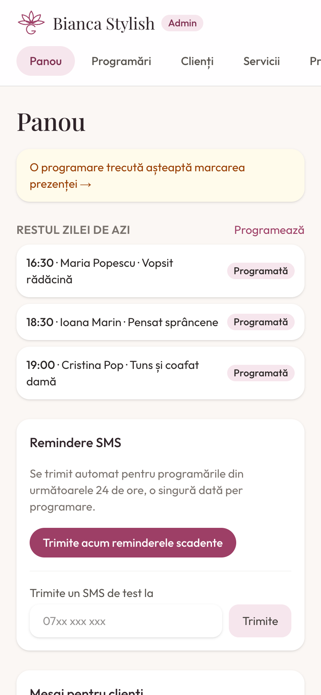

# Glowi — salon booking app

A mobile-first web app for a beauty salon, in Romanian. Clients see their appointments, the salon's services and messages; the admin manages services, clients, bookings, attendance and SMS reminders. Works on phones, tablets and desktop.

<p>
  
  
  
</p>

More screenshots (phone, tablet, desktop) are in [`marketing/`](marketing).

## Features

**Clients** (log in with phone number + password from the salon)
- Home screen with their next appointment and a message from the salon
- Services with photos, duration and price (or "Preț la cerere")
- Upcoming and past appointments with status
- Ask to cancel or reschedule an appointment; after the salon approves a reschedule, pick a new free time from a calendar (busy times and closed days are shown but can't be chosen)
- Maintenance: see and stop the "come back" reminders
- Profile: change password, manage SMS/email marketing consent (GDPR)

**Admin**
- Dashboard: rest of today, visits waiting for attendance, quick-start guide, SMS tools, client announcement
- Requests (Cereri): approve or reject clients' cancel/reschedule requests; cancellations get "Anulată la timp" / "Anulată târziu" automatically from the notice given
- Calendar: block whole days or time ranges (e.g. a wedding) for everyone; warns about appointments already inside
- Maintenance (Întreținere): each service has a "come back after N weeks" interval; when a visit is marked Onorată the admin decides whether the client wants it, and the client gets an SMS at 10:00 on the due day
- Appointments: booking with automatic end time (duration + cleanup buffer), no double booking (enforced in the database), rescheduling, attendance (Onorată, Întârziat 5–30 min, Neonorată, Anulată târziu / la timp)
- Clients: create clients (phone required, email optional), allergies, private notes, consent, full visit history and stats, call/WhatsApp buttons
- Services and categories: price, duration, cleanup buffer, photo upload, hide/show, ordering
- Profile: salon name, phone and weekly opening hours, own login and password
- Error log at `/admin/logs` (faint "logs" link at the bottom of admin pages)

**SMS** via [SMSLink](https://www.smslink.ro): a confirmation when an appointment is booked or rescheduled, a reminder at 10:00 the day before, maintenance reminders, and the salon's answer to cancel/reschedule requests.

## Tech

Next.js 16.4 (App Router, Cache Components) · React 19 · TypeScript · Tailwind CSS v4 · PostgreSQL + Prisma 7 · Zod · jose (signed session cookie) · SWR

## Getting started

### Requirements

- Node.js 20+
- PostgreSQL 14+ (locally, e.g. `brew install postgresql@16 && brew services start postgresql@16`)

### 1. Install

```bash
npm install
```

### 2. Configure `.env`

Create `.env` in the project root (it is git-ignored):

```bash
# Database
DATABASE_URL="postgresql://YOUR_USER@localhost:5432/glowi"

# Signs the login cookie — generate with: openssl rand -base64 32
SESSION_SECRET="..."

# SMSLink SMS Gateway (SMS Gateway → Configurare și setări in your SMSLink account)
SMSLINK_CONNECTION_ID=""
SMSLINK_PASSWORD=""
SMSLINK_TEST=1            # 1 = simulate (nothing delivered), 0 = send real SMS
SMSLINK_SENDER=""         # optional; the sender name must be approved by SMSLink first

# Protects the reminders endpoint — generate with: openssl rand -hex 32
CRON_SECRET="..."

# Optional fallbacks; the admin sets these in Profil → Salonul
SALON_NAME="Stylish Salon"
SALON_PHONE=""
```

### 3. Create the database

```bash
createdb glowi
npx prisma migrate dev
npx prisma generate
npx prisma db seed            # services, categories, admin and one client
npm run db:seed:demo          # optional: demo clients, appointments and service photos
```

### 4. Run

```bash
npm run dev
```

Open http://localhost:3000.

### Logins

| Who | Where | Login | Password |
|---|---|---|---|
| Admin | `/admin/login` | `admin@glowi.test` | `password123` — change it in Profil |
| Demo client (after `db:seed:demo`) | `/login` | `0744 555 101` (Maria Popescu) | `Demo2026` |

Other demo clients: `0745 555 202`, `0746 555 303`, `0747 555 404`, `0748 555 505` (same password). Remove the demo data with `npm run db:seed:demo -- --remove`.

## Install on a phone (PWA)

The app is installable: on **iPhone/iPad** open it in Safari → Share → **Adaugă pe ecranul principal**; on **Android/Chrome** use the **Instalează** button shown in the app (or the browser menu). It then opens full-screen from its own icon, named after the salon (Profil → Salonul).

- `app/manifest.ts` (name, icons, `start_url: /start`, which sends admins to `/admin`, clients to `/home`, others to `/`)
- Icons in `public/icons/` plus `app/apple-icon.png` and `app/icon.svg`
- `public/sw.js` only shows `public/offline.html` when there is no connection; it caches nothing else, so appointments are never stale
- Installation needs HTTPS in production (`localhost` is allowed for development)


Reminders go out when `GET /api/cron/reminders` is called with the secret:

```bash
curl -H "Authorization: Bearer $CRON_SECRET" https://your-domain/api/cron/reminders
```

It sends reminders for **tomorrow's** appointments and only acts between 10:00 and 21:00 (salon time), once per appointment. Call it **every hour** from a scheduler (server crontab, Vercel Cron on a Pro plan, or an external cron service). Booking confirmations are sent automatically when the admin books or reschedules. The admin can also press **Trimite acum reminderele pentru mâine** on the dashboard, and send a test SMS from there. While `SMSLINK_TEST=1`, nothing is delivered.

## Deployment

Production runs on your own server with Docker (app, Postgres, a scheduler for SMS and backups; HTTPS through the server's existing reverse proxy or a bundled Caddy), deployed by Azure Pipelines on every push to `main`. Step-by-step setup: **[docs/DEPLOY.md](docs/DEPLOY.md)**.

| File | Purpose |
|---|---|
| `Dockerfile` | Multi-stage image (`migrator` + standalone `runner`) |
| `compose.prod.yaml` | db, app, cron, migrate; optional caddy |
| `deploy/compose.external-proxy.yaml`, `deploy/Caddyfile.snippet` | Running behind an existing Caddy in Docker |
| `deploy/deploy.sh` | Release on the server: migrate → build → start, rollback if unhealthy |
| `azure-pipelines.yml` | CI checks + SSH deploy (Azure DevOps, GitHub repo) |
| `.env.production.example` | Every production setting |

## Useful commands

| Command | What it does |
|---|---|
| `npm run dev` | Development server |
| `npm run lint` / `npx tsc --noEmit` | Lint / type-check |
| `npx prisma migrate dev --name <change>` | Apply a schema change (then `npx prisma generate` and restart `npm run dev`) |
| `npx prisma studio` | Browse the database |
| `npm run db:seed:demo` / `-- --remove` | Add / remove demo data |

## Troubleshooting

- **`db.<something>` is undefined after a schema change** — restart `npm run dev`; the running server keeps the old Prisma client.
- **Dev server stuck on "Compiling …"** — stop it, delete `.next/dev`, start again.
- **Login fails with the seed password** — the password may have been changed in the app; set a new one from the admin client page or Profil.

## Project notes for contributors

Architecture, conventions and Next.js 16 specifics (Cache Components, Suspense, security pattern) are described in [docs/ARCHITECTURE.md](docs/ARCHITECTURE.md).
